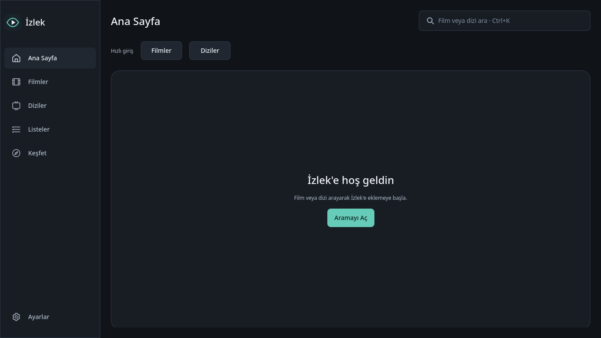

# İzlek

## İzlek nedir?

İzlek, Linux için geliştirilen, yerel öncelikli ve açık kaynak bir film ve dizi takip masaüstü uygulamasıdır. Görünen adı **İzlek**, Python paket adı `izlek` ve repository adı `Izlek`tir. Uygulama hesap oluşturmaz; takip durumları, bölüm ilerlemesi, favoriler ve listeler kullanıcının cihazındaki SQLite veritabanında tutulur. TMDb tokenı da yalnızca kullanıcının cihazında, tercihen sistem anahtarlığında saklanır.

Kaynak kod: [Teknoloji-Filozoflari/Izlek](https://github.com/Teknoloji-Filozoflari/Izlek)

Tamamlanan fazlar ve doğrulamalar için [devir notuna](docs/HANDOFF.md) bakın.

## Özellikler

- Film ve diziler için yerel takip durumları, favoriler ve özel listeler
- Dizi bölüm ilerlemesi ve kaldığı yerden devam etme
- TMDb üzerinden arama ve metadata; çevrimdışı kullanılabilen yerel kütüphane
- Türkçe, koyu temalı ve klavye ile kullanılabilir Qt Quick arayüzü

## Screenshots / Ekran görüntüleri



[Yerel örnek içerikli bileşen galerisi: 1366×768](docs/screenshots/components-1366.png) · [1920×1080](docs/screenshots/components-1920.png)

## Geliştirici kurulumu

Python 3.11 veya daha yeni bir sürüm, `pip` ve PySide6'nın Linux sistem gereksinimleri gerekir:

```bash
python -m venv .venv
source .venv/bin/activate
python -m pip install -e '.[dev]'
python -m izlek
python -m izlek --gallery
python scripts/quality.py
python -m pip wheel . --no-deps --wheel-dir dist
```

`python scripts/quality.py`, önce `ruff check .`, ardından tüm `pytest` testlerini
offscreen Qt ayarlarıyla çalıştıran tek kalite kapısıdır. Test paketi gerçek ağ
bağlantılarını engeller; TMDb yanıtları `httpx.MockTransport` ile sağlandığı için
CI ortamında gerçek token gerekmez. Tek tek çalıştırmak için `python -m pytest`
ve `ruff check .` komutları da kullanılabilir.

`python -m izlek` masaüstü penceresini açar. İlk açılan **Ana Sayfa**, Keşfet filtreleri ve Film/Dizi seçilebilen global aramayı içerir. **İstatistikler** (Ctrl+5) altında toplam ekran süresi, izleme sayaçları, son 12 ay bölüm grafiği, tür halkası ve en çok zaman ayrılan diziler toplanır. Aylık grafik yalnız gerçek izleme tarihi ve süresi kayıtlı bölümleri kullanır; film izleme tarihi tutulmadığı için filmler grafiğe dahil edilmez. Toplam süre yalnız süresi bilinen film ve bölümlerden hesaplanır; süresi bilinmeyen içerikler süre toplamına katılmaz ve kaç içerik dışarıda kaldığı gösterilir. **Devam Et** Diziler sekmesindedir; İstatistikler sayfası yalnız istatistikleri gösterir.

Filmler ve Diziler yerel kütüphaneleri, Listeler özel listeleri gösterir. Dizi kartı ve detay ekranında bölüm sayacı ile ilerleme çubuğu bulunur; özel sezonlar ana ilerleme çubuğuna katılmaz. Bölüm satırlarındaki yazısız yuvarlak tik fare veya Space ile değiştirilir. `--gallery`, [bileşen kütüphanesini](docs/components.md) çevrimdışı örnek veriyle gösterir. Pencere boyutu ve büyütülmüş durumu XDG config dizininde saklanır; diğer XDG yolları [mimari belgesinde](docs/architecture.md) açıklanır. Ekransız CI için `QT_QPA_PLATFORM=offscreen QT_QUICK_BACKEND=software python -m pytest` kullanın.

İlk açılışta Alembic migration'ları otomatik uygulanır. Kişisel veritabanı `$XDG_DATA_HOME/izlek/izlek.sqlite3` konumundadır; değişken tanımlı değilse `~/.local/share/izlek/izlek.sqlite3` kullanılır. Komut satırından migration çalıştırmak için kurulu sanal ortamda `python -m alembic -c alembic.ini upgrade head` kullanın. SQLite dosyasını yedeklemeden elle değiştirmeyin.

`No module named izlek` hatasında proje kökünde `.venv/bin/python -m izlek` çalıştırın; paket sanal ortama kurulmamışsa yukarıdaki `pip install -e '.[dev]'` adımını uygulayın. `No module named PySide6` hatasında da bağımlılık kurulumu eksiktir. İnternet erişimi yoksa ve PySide6 dağıtımınızda kuruluysa sanal ortamı `python -m venv --system-site-packages .venv` ile oluşturup `./.venv/bin/python -m pip install --no-deps --no-build-isolation -e .` çalıştırabilirsiniz.

Wayland veya X11 oturumunda gerçek pencere açılışını ve sidebar gezinmesini sınamak için normal masaüstü terminalinde şu komutları çalıştırın:

```bash
./.venv/bin/python scripts/smoke_display.py --platform wayland
./.venv/bin/python scripts/smoke_display.py --platform xcb
```

Test, kullanılan Qt platformunu ve QML uyarı sayısını yazar; isteğe bağlı `--gallery`, `--onboarding` ve `--screenshot /tmp/izlek.png` seçenekleri vardır. Normal gezinme denemesi örnek token durumu kullanır; `--onboarding` ilk açılış ekranını sınar. Ekransız doğrulama için `--platform offscreen` kullanılabilir.

Wayland ve X11 oturumlarında `App info not found for 'izlek'` portal uyarısı görünürse geliştirme başlatıcısını kullanıcı hesabınıza kurun:

```bash
./.venv/bin/python scripts/install_desktop_entry.py
```

Bu komut `$XDG_DATA_HOME` (varsayılan `~/.local/share`) altına `applications/izlek.desktop` ile `icons/hicolor/scalable/apps/izlek.svg` yazar. Masaüstü menüsünden **İzlek** başlatılabilir. Var olan, bu geliştirme betiğinin oluşturmadığı bir `izlek.desktop` dosyasını değiştirmez. Kurulumdan sonra Wayland ve X11 testlerini yeniden çalıştırın; test artık QML ve diğer Qt uyarılarını ayrı raporlar.

## TMDb token

İzlek hesap oluşturmaz; TMDb metadata'sına erişmek için kendi TMDb hesabınızın
API ayarlarından **API Read Access Token** almanız gerekir. İlk açılışta bu
tokenı girip **Tokenı Test Et** ile doğrulayın; **Kaydet** de doğrulama yapar
ve yalnızca başarılı sonucu saklar. Token kullanıcının cihazında kalır ve
sonraki açılışlarda yeniden sorulmaz; **Ayarlar → TMDb → Tokenı Değiştir** ile
değiştirilebilir.

Öncelikle sistem anahtarlığı (Secret Service/KWallet) kullanılır. Kullanılamazsa token, `$XDG_CONFIG_HOME/izlek/tmdb-token` dosyasında yalnızca kullanıcıya açık izinlerle **düz metin** olarak saklanır ve uygulama bu durumu bildirir. Token SQLite'a, pencere ayarlarına veya loglara yazılmaz. Geliştirme ortamında yeni bağımlılıkları almak için tekrar `python -m pip install -e '.[dev]'` çalıştırın. Token'ı repository'ye veya issue'lara koymayın.

## TMDb API istemcisi

`izlek.tmdb.client.TmdbClient(token=...)` arayüzden bağımsız olarak configuration, film/dizi araması, film/dizi detayı ve dizi sezonu uç noktalarını çağırır. Yanıtlar `izlek.tmdb.models` içindeki Pydantic modellerine çevrilir. İstemciyi ağ çağrıları için UI thread'i dışında kullanın. Timeout, HTTP ve bozuk yanıt hataları `izlek.tmdb.client` içindeki güvenli domain exceptionlarına dönüşür. Bir 429 yanıtında en fazla bir kez, en çok iki saniyelik beklemeyle tekrar denenir. Testler gerçek TMDb'ye bağlanmaz; `httpx.MockTransport` kullanır.

## Görsel servisi ve cache

`ImageService(TmdbClient(token=...))`, `poster(path, "grid")`, `poster(path, "detail")` ve `backdrop(path)` çağrıları için yerel dosya yoluyla sonuçlanan `Future[Path]` döndürür. Ağ çağrıları servis işçi havuzunda yapılır; UI bu sonucu hazır olduğunda kullanmalıdır. Görsel boyutları TMDb configuration yanıtından seçilir ve `original` indirilmez. Geçerli görseller `$XDG_CACHE_HOME/izlek/images` altında hash anahtarlı dosyalarda tutulur. Cache okunamaz veya ağ kullanılamazsa servis poster/backdrop placeholder SVG yollarını döndürür. `cache_size_async()` ileride Ayarlar'da kullanılabilecek byte cinsinden cache boyutunu verir. Bu dizin yalnızca yeniden indirilebilir görseller içindir; kişisel takip verisi SQLite veri dizininde kalır.

## Global arama

Ana penceredeki her sayfadan **Ctrl+K** ile arama açılır, **Esc** ile kapanır. En az üç karakter girildiğinde 300 ms bekledikten sonra TMDb film ve dizi aramaları arka planda paralel çalışır. Sonuçlar ayrı başlıklarda orijinal ad, yıl, tür ve cache'lenmiş posterle gösterilir. Sonuca tıklamak medya detay sayfasını açar. Çevrimdışıyken açıklayıcı hata gösterilir.

## Keşfet

**Keşfet**, TMDb'nin yalnızca Discover Movie ve Discover TV uçlarını kullanır. Film veya dizi, yıl, tür, ülke ve puan aralığı seçilebilir. Sonuçlar `vote_average.desc` ile sıralanır; az sayıdaki oyun sıralamayı bozmasını önlemek için varsayılan en az oy eşiği 100'dür. Sonuçlar yoğun gridde gösterilir ve açık önceki/sonraki düğmeleriyle sayfalanır.

## Film detayı ve yerel takip

Film arama sonucundan açılan ekran; TMDb detay, oyuncu/yönetmen, video, öneri ve Türkiye izleme sağlayıcısı verilerini arka planda yükler. Poster ve backdrop görsel servisini kullanır. **Kütüphaneye Ekle** filmi `PLANNED` durumuyla yerel kütüphaneye ekler; takip durumu, favori ve özel liste üyeliği SQLite'ta kalıcıdır. Film metadata'sı aynı veritabanında kişisel durumdan ayrı saklanır. Detay açıldığında kayıtlı metadata hemen gösterilir; son başarılı sync 24 saatten eskiyse arka planda yenilenir. Offline, timeout veya TMDb'de silinmiş kayıt durumunda yerel kopya korunur. **Fragmanı İzle**, uygun YouTube fragmanını sistem tarayıcısında açar. İzleme sağlayıcısı verisi [TMDb'nin JustWatch ortaklığı](https://developer.themoviedb.org/reference/movie-watch-providers) kaynaklıdır.

Dizi detayında orijinal ad, yayın tarihleri, yaratıcılar, oyuncular, yapım bilgileri, Türkiye izleme sağlayıcıları, fragman ve öneriler gösterilir. Sezon seçimi bölüm listesini açar; her bölüm ayrı işaretlenebilir. Sezonun veya dizinin tüm bölümlerini izlendi/izlenmedi yapmak için onay gerekir. Dizi detayı ve her sezonun bölüm metadata'sı kendi son başarılı sync zamanına göre 24 saatlik freshness uygular. Bölüm ilerlemesi yalnızca yerel veritabanındadır ve metadata yenilemesiyle silinmez. Daha önce indirilen metadata çevrimdışı kullanılabilir. Diziler için durum ve favori de kalıcıdır.

Film ve dizi detaylarındaki **Nerede İzlenir** bölümü varsayılan olarak TR bölgesinin TMDb watch-provider yanıtını gösterir. Abonelik, kiralama ve satın alma grupları boşsa Türkiye için açıklayıcı bir empty state görünür; geçerli TMDb bağlantısı varsa sağlayıcı seçenekleri sistem tarayıcısında açılır. Provider metadata'sı cache'lenir ve takip durumunun parçası değildir. Bölümde JustWatch attribution'ı görünür.

İlk izlenen bölüm otomatik olarak `WATCHING`, bütün bilinen yayınlanmış bölümler izlendiğinde durum `WATCHED` olur. Manuel status seçimi korunur; sonradan gelen yeni bölüm `WATCHED` durumunu sessizce değiştirmez. Ayrıntılar [durum otomasyonu kurallarında](docs/status-automation.md).

## Favoriler

Film ve dizi favorileri SQLite içindeki `user_media.favorite` alanından okunur. Detay sayfalarında ve kütüphane kartlarında kalp düğmesi kullanılır. İstatistikler sayfasında Favorilerim bölümü bulunmaz. Favori ekleme ve çıkarma takip durumunu değiştirmez; durum olmadan da favori tutulabilir.

## Özel listeler

**Listeler** sayfasında liste oluşturabilir, yeniden adlandırabilir ve silebilirsin. Sol panelde listeleri, sağ panelde seçilen listenin film ve dizilerini görürsün. Yerel veritabanında bilinen medyayı ekleyebilir, çıkarabilir; ok düğmeleriyle liste ve medya sırasını değiştirebilirsin. Aynı medya birden fazla listede bulunabilir. Film ve dizi detayındaki **Listeye Ekle**, mevcut liste adıyla eşleşir veya yeni liste oluşturur. Bütün liste verileri SQLite'ta kalır; TMDb liste API'si kullanılmaz.

## İçe ve dışa aktarma

**Ayarlar → İçe / Dışa Aktarma** bölümünden tüm taşınabilir İzlek durumunu tek bir JSON dosyasına aktarabilirsin. Dosya film/dizi metadata'sını, takip durumlarını, bölüm ilerlemesini, favorileri ve özel listeleri içerir; TMDb tokenı ile indirilen görsel cache yollarını içermez. Import öncesinde şema doğrulanır ve medya/liste özeti gösterilir. Aynı TMDb kimliği ve medya türü birleştirilir; izlenmiş bölüm ilerlemesi ile mevcut liste üyelikleri kaybolmaz. Biçim ve sürüm stratejisi [İzlek JSON belgesinde](docs/izlek-json.md) açıklanır.

## Linux paketlerinin durumu

| Biçim | Hedef | Durum |
| --- | --- | --- |
| AppImage | x86_64 Linux | Build betiği ve GitHub Actions build/smoke akışı mevcut; yayımlanmış binary yok. |
| `.deb` | Debian/Ubuntu amd64 | Build betiği ve Ubuntu 22.04/24.04 CI kontrolü mevcut; yayımlanmış binary yok. |
| Arch / AUR | Arch Linux | PKGBUILD mevcut; checksum ve `.SRCINFO` tamamlandıktan sonra ayrıca AUR'a gönderilmeli. |
| Wheel / kaynak arşivi | Python 3.11+ Linux | Yerel build ile üretilebilir; Python/Qt bağımlılıkları gerekir. |

`main` dalına kaynak kod göndermek paketleri yayımlamaz. AppImage ve `.deb`
üretimi Actions üzerinden elle başlatılabilir; GitHub Releases yayını sürüm
etiketiyle çalışır. AUR gönderimi ayrı bir işlemdir.

## AppImage

İlk binary dağıtım biçimi x86_64 AppImage'dır. Yerel paketleme araçlarını
kurmak ve doğrulanmış sırayla one-folder → AppDir → AppImage üretmek için:

```bash
python -m pip install \
  --constraint packaging/constraints-appimage.txt \
  -e '.[dev,package]'
python scripts/quality.py
python scripts/build_appimage.py --appdir-only
python scripts/build_appimage.py \
  --appimagetool /path/to/appimagetool-x86_64.AppImage \
  --runtime-file /path/to/runtime-x86_64
```

İlk komut yalnızca AppImage build'inde PySide6'yı glibc 2.28 uyumlu sürüme
sabitler. Build betiği önce `dist/izlek/` one-folder çıktısını offscreen açar,
QML, kaynaklar ve migration'ları doğrular; ardından
`build/appimage/Izlek.AppDir/` oluşturur. Son AppImage ve SHA-256 dosyası
`dist/` altına yazılır.

GitHub'daki [Release Linux artifacts workflow](.github/workflows/release.yml),
`v*` tag'lerinde glibc 2.28 tabanlı manylinux container'ında AppImage üretir.
Artifact ayrıca temiz Ubuntu 22.04 ve 24.04 runner'larında sınanır. FUSE
bulunmayan ortamlarda `APPIMAGE_EXTRACT_AND_RUN=1 ./Izlek-*.AppImage`
kullanılabilir. Ayrıntılı tag ve yayın adımları [release sürecinde](docs/releases.md)
yer alır.

1.0.0 release dosyasının adı `Izlek-1.0.0-x86_64.AppImage` olacaktır.

AppImage salt okunur uygulama içeriği taşır. Veritabanı, ayarlar ve cache
sırasıyla XDG data, config ve cache kullanıcı dizinlerinde kalır; AppImage'ın
yanına yazılmaz. AUR yayını ve release `.deb` artefact'ı henüz yayımlanmamıştır;
yerel build tanımları repository'de bulunur.

## Arch Linux / Arch (PKGBUILD)

Arch paketi adı `izlek`tir. Paket, Python kaynak wheel'ını sistem Python'una
kurar; masaüstü kaydı ile ölçeklenebilir simgeyi de kurar. Çalışma zamanı
bağımlılıkları (`pyside6`, SQLAlchemy, Alembic, httpx, Pydantic ve keyring)
pakete bağımlılık olarak tanımlıdır; build/test araçları runtime'a eklenmez.

`v1.0.0` tag'inden yerelde paket sınamak için:

```bash
git archive --format=tar.gz --prefix=Izlek-1.0.0/ v1.0.0 \
  -o packaging/arch/izlek-1.0.0.tar.gz
cd packaging/arch
makepkg --syncdeps --install
```

PKGBUILD, [packaging/arch/PKGBUILD](packaging/arch/PKGBUILD) altında yer alır.
Upstream GitHub URL'si tanımlıdır. AUR'a gönderimden önce sürüm tag'i
yayımlanmalı, `updpkgsums` ile gerçek SHA-256 yazılmalı ve
`makepkg --printsrcinfo > .SRCINFO` çalıştırılmalıdır. Mevcut `SKIP` değeri
AUR yayını için tamamlanmış bir doğrulama değildir. Paket kaldırıldığında pacman yalnızca sistem
dosyalarını kaldırır; `$XDG_DATA_HOME/izlek`, `$XDG_CONFIG_HOME/izlek` ve
`$XDG_CACHE_HOME/izlek` altındaki kullanıcı verileri silinmez.

## Debian/Ubuntu (`.deb`)

Debian/Ubuntu paketi PyInstaller one-folder uygulamasını `/usr/lib/izlek`,
başlatıcıyı `/usr/bin/izlek`, desktop kaydını
`/usr/share/applications/izlek.desktop` ve SVG simgesini hicolor tema yoluna
kurar. Python uygulaması bundle içindedir; böylece Ubuntu'nun sistem
depolarındaki PySide6/Pydantic sürüm farkları paketi bozmaz.

Python 3.11, `dpkg-deb`, PyInstaller ve build bağımlılıkları olan bir
Debian/Ubuntu build ortamında:

```bash
python -m pip install \
  --constraint packaging/constraints-appimage.txt \
  -e '.[dev,package]'
python scripts/build_deb.py \
  --homepage "$REPOSITORY_URL" \
  --maintainer "$DEBIAN_MAINTAINER"
sudo apt install ./dist/izlek_1.0.0_amd64.deb
```

Kurulumdan sonra uygulama menüsünde **İzlek** görünür. `apt remove izlek`,
yalnızca paket dosyalarını kaldırır; kullanıcı veritabanı, token, ayar ve cache
XDG dizinlerinde kalır. Ubuntu 22.04 ve 24.04 temiz konak kurulum/smoke
kontrolü release workflow'u ile otomatik çalışır. `REPOSITORY_URL` gerçek HTTPS
upstream adresi, `DEBIAN_MAINTAINER` ise `Ad <eposta>` biçimindeki paket
sorumlusudur. Tag workflow'u bu değerleri GitHub repository bağlamından üretir;
build betiği yer tutucu metadata ile paket oluşturmayı reddeder.

## Mimari

İzlek'in veri akışı QML → controller/view-model → service → repository veya
TMDb client → SQLite/TMDb şeklindedir. QML içinde SQL, HTTP veya iş mantığı
bulunmaz. Uygulama Python/PySide6/Qt Quick, SQLAlchemy + Alembic ve merkezi
TMDb client kullanır; kişisel veriler XDG data/config/cache dizinlerinde
yaşar. Katmanların ayrıntıları [mimari belgesinde](docs/architecture.md),
tamamlanan fazlar ve doğrulamalar ise [devir notunda](docs/HANDOFF.md) bulunur.

## Katkı

Katkı akışı, test beklentileri ve kodlama kuralları için
[CONTRIBUTING.md](CONTRIBUTING.md) dosyasını okuyun. Hata ve özellik önerileri
için GitHub issue şablonlarını kullanın; güvenlik açıklarını public issue veya
PR'a koymayın, [SECURITY.md](SECURITY.md) sürecini izleyin.

## Roadmap

- Sürüm tag'leri ve doğrulanmış Linux paket yayınları
- AppImage, Arch ve Debian/Ubuntu artefact'larının gerçek release'lerle yayımlanması
- Offline-first akışların ve desteklenen Linux dağıtımlarının genişletilmesi
- Erişilebilirlik, yerelleştirme ve paketleme doğrulamalarının genişletilmesi

## Privacy

İzlek hesap, reklam, analytics veya cloud backend kullanmaz. Film/dizi takip
verisi, bölüm ilerlemesi, favoriler, listeler ve metadata cache'i cihazdaki
XDG dizinlerinde tutulur; uygulama bunları uzaktaki bir İzlek hesabına göndermez.
TMDb sorguları yalnızca metadata gerektiğinde yapılır. TMDb tokenı sistem
anahtarlığında saklanır; anahtarlık kullanılamazsa yalnızca kullanıcı izinli
`$XDG_CONFIG_HOME/izlek/tmdb-token` dosyasına yazılır ve loglara, SQLite'a veya
export dosyalarına konmaz. Taşınabilir export tokenı ve indirilebilir görsel
cache yollarını içermez.

Uzak film/dizi bilgileri, sezon/bölüm metadata'sı, sağlayıcı yanıtları ve
kütüphaneye ait olmayan görseller 180 günlük saklama süresi sonunda temizlenir.
Kütüphane afişleri ve arka planları yerelde korunur. Kontrol uygulama
açılışında ve açık kaldığı sürece saatlik olarak arka planda yapılır. Takip
durumları, bölüm ilerlemeleri, favoriler ve listeler silinmez. Süresi dolmuş
başlıklar yeni metadata indirilene kadar `Film #42` / `Dizi #77` biçiminde
gösterilir; temizlenen süre bilgileri istatistiklerde eksik veri sayılır.
Geliştirme testleri ve ekran deneme betiği geçici XDG dizinleri kullanır;
gerçek kütüphaneye ve sistem anahtarlığına erişmez.

## TMDb / JustWatch attribution

Film, dizi, kişi, puan ve görsel bilgileri TMDB tarafından sağlanır; takip
durumları, favoriler ve listeler yalnızca cihazdaki İzlek verisidir. Hakkında
ekranı TMDB'nin gerekli bildirimi olan aşağıdaki metni gösterir:

> This product uses the TMDB API but is not endorsed or certified by TMDB.

Türkiye izleme seçeneği uygunluk bilgisi JustWatch tarafından sağlanır ve
uygulama her provider bölümünde bu attribution'ı gösterir. Provider bağlantısı
TMDB yanıtındaki TMDB URL'sidir; İzlek bir provider veya JustWatch hizmeti
değildir. Ayrıntılı release öncesi denetim, logo gereksinimi ve cache
sınırları için [TMDB / JustWatch uyumluluk notuna](docs/TMDB_JUSTWATCH_COMPLIANCE.md)
bakın.

## License

İzlek, [GNU General Public License v3 veya sonrası](LICENSE) altında
lisanslanır. Katkılar aynı lisans koşullarıyla sunulmalıdır.
