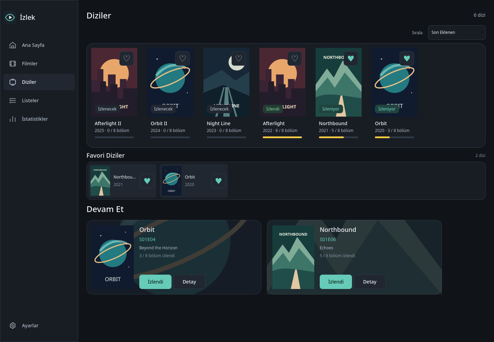
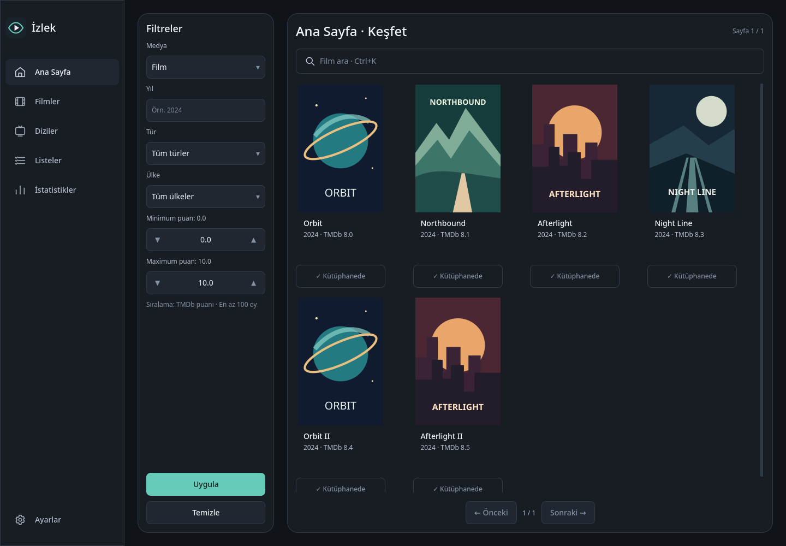
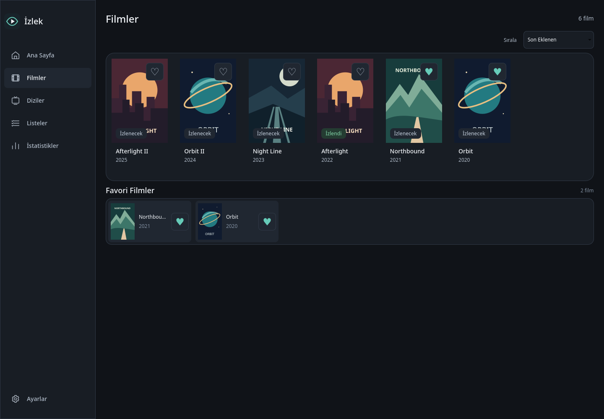
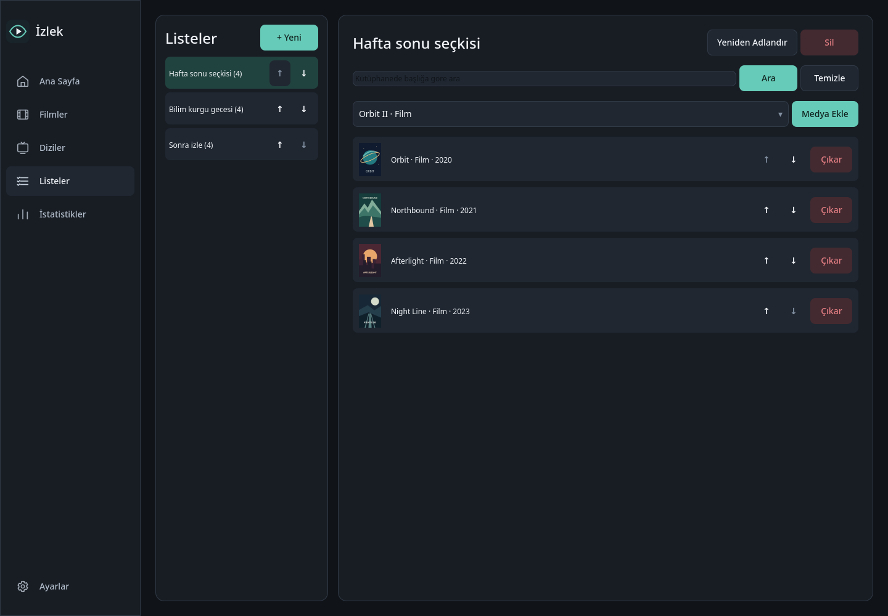
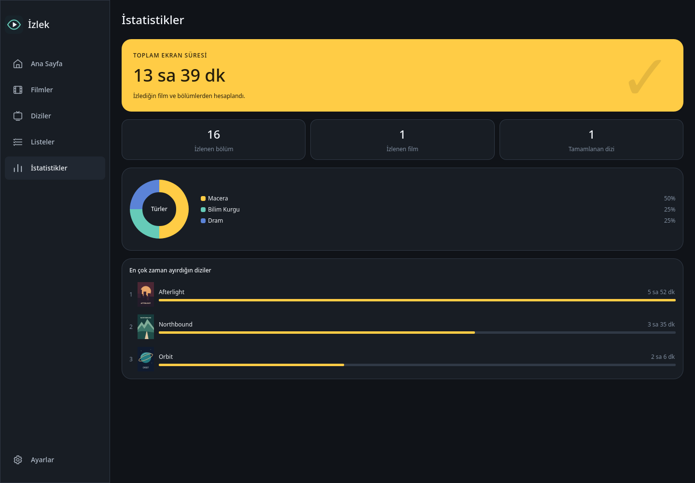

<div align="center">


# İzlek

**Filmlerini, dizilerini ve kaldığın bölümü tek yerde takip et.**

Linux için açık kaynak, Türkçe bir masaüstü uygulaması.<br>
Kütüphanen, listelerin ve izleme geçmişin cihazında kalır.

[](https://github.com/Teknoloji-Filozoflari/Izlek/actions/workflows/ci.yml)
[](pyproject.toml)
[](#linux-kurulumu)
[](LICENSE)

[Özellikler](#özellikler) · [Ekran görüntüleri](#ekran-görüntüleri) · [Kurulum](#linux-kurulumu) · [Belgeler](#belgeler) · [Katkı](#katkı)

</div>



## Özellikler

| | İzlek ile |
| --- | --- |
| **Kütüphanen** | Film ve dizilerini İzlenecek, İzleniyor ve İzlendi durumlarıyla düzenle; favorilerini seç. |
| **Kaldığın bölüm** | Bölümleri tek tek işaretle, sezon ilerlemesini gör ve Diziler sekmesindeki Devam Et kartlarından devam et. |
| **Keşfet ve ara** | TMDB içeriklerini tür, yıl, ülke ve puanla filtrele; `Ctrl+K` ile film/dizi ara. |
| **İçerik detayları** | Oyuncular, fragmanlar, öneriler ve Türkiye’deki izleme sağlayıcılarını incele. |
| **Özel listeler** | Kendi seçkilerini oluştur; listeye eklerken yerel kütüphanende arama yap. |
| **İstatistikler** | İzlenen film/bölüm sayısını, tür dağılımını ve ekran süresini gör. Bilinmeyen süreler toplamı şişirmez. |
| **Çevrimdışı kullanım** | Kayıtlı kütüphane bilgilerine eriş; kütüphane afişleri ve arka planları yerelde korunsun. |
| **Veri aktarımı** | Kütüphaneni ve ilerlemeni JSON olarak dışa aktar, başka kurulumda içe al. |

Hesap oluşturma, reklam veya analytics yok. İçerik araması ve yeni bilgiler için
internet ve kendi **TMDB API Read Access Token**’ın gerekir.

## Ekran görüntüleri

Görseller güncel uygulamadan, geçici bir demo kütüphaneyle **1440 × 1000**
boyutunda alındı. Başlıklar ve afişler projedeki örnek içeriklerdir;
gerçek kullanıcı verisi içermez. Görsellere tıklayarak tam boyutta açabilirsin.

<table>
  <tr>
    <td width="50%"><strong>Ana Sayfa · Keşfet</strong><br>Filtreler, arama ve hızlı kütüphane ekleme.<br><a href="docs/screenshots/discover.png"></a></td>
    <td width="50%"><strong>Film kütüphanesi</strong><br>Takip durumları ve favoriler bir arada.<br><a href="docs/screenshots/movies.png"></a></td>
  </tr>
  <tr>
    <td width="50%"><strong>Özel listeler</strong><br>Kendi izleme seçkilerini oluştur.<br><a href="docs/screenshots/lists.png"></a></td>
    <td width="50%"><strong>İstatistikler</strong><br>Ekran süresi, türler ve en çok izlenen diziler.<br><a href="docs/screenshots/statistics.png"></a></td>
  </tr>
</table>

## Linux kurulumu

**Paketleme tanımları mevcut; henüz yayımlanmış indirilebilir bir sürüm yok.**
Şimdilik kaynak koddan çalıştırabilir veya aşağıdaki build akışlarını kullanabilirsin.

| Biçim | Hedef | Build / durum |
| --- | --- | --- |
| **AppImage** | x86_64 Linux | [Build betiği](scripts/build_appimage.py); tag release akışında üretilir. |
| **DEB** | Debian / Ubuntu amd64 | [Paketleme rehberi](packaging/debian/README.md); tag release akışında üretilir. |
| **Arch / AUR** | Arch Linux | [PKGBUILD rehberi](packaging/arch/README.md); gerçek checksum ve `.SRCINFO` sonrası ayrı AUR yayını gerekir. |
| **RPM** | Fedora x86_64 | [Paketleme rehberi](packaging/rpm/README.md); elle başlatılan Fedora 43 workflow’u. Binary doğrulaması bekliyor. |
| **Snap** | core24 amd64 | [Paketleme rehberi](snap/README.md); elle başlatılan strict Snap workflow’u. Store yayını yok. |
| **Nix / NixOS** | x86_64 / aarch64 Linux | [Flake rehberi](packaging/nix/README.md); x86_64 Nix build ve açılış kontrolü geçti. Nixpkgs resmî yayını yok. |
| **Wheel / kaynak** | Python 3.11+ Linux | Yerel build ile üretilebilir; Python ve Qt bağımlılıkları gerekir. |

AppImage ve DEB için Ubuntu 22.04/24.04 kontrolleri workflow’larda tanımlıdır.
RPM için diğer dağıtımlar ayrıca test edilmelidir. Snap verileri sistem
kurulumundan ayrı tutulur. Kaynakları `main` dalına göndermek, paket yayını yapmaz.
Yayın adımları: [release rehberi](docs/releases.md).

### Kaynak koddan çalıştır

Python **3.11 veya üzeri**, `pip`, sanal ortam desteği ve PySide6’nın Linux
çalışma zamanı kütüphaneleri gerekir.

```bash
git clone https://github.com/Teknoloji-Filozoflari/Izlek.git
cd Izlek
python3 -m venv .venv
source .venv/bin/activate
python -m pip install -e '.[dev]'
python -m izlek
```

Qt sistem gereksinimleri, sorun giderme ve geliştirici komutları için
[geliştirme rehberine](docs/development.md) bak.

### İlk açılış

1. TMDB hesabının API ayarlarından **API Read Access Token** al.
2. İzlek’e tokenı gir, **Tokenı Test Et** ve **Kaydet** adımlarını tamamla.
3. Ana Sayfa’dan içerik ara veya keşfet; kütüphanene ekleyip izleme durumunu seç.

Token cihazında saklanır. Sonradan **Ayarlar → TMDb → Tokenı Değiştir**
üzerinden güncelleyebilirsin. İzlek için ayrıca bir hesap gerekmez.

## Verilerin nerede?

| Veri | Varsayılan konum |
| --- | --- |
| Kütüphane, listeler ve bölüm ilerlemesi | `~/.local/share/izlek/izlek.sqlite3` |
| Pencere ayarları | `~/.config/izlek/window.ini` |
| İndirilen görseller | `~/.cache/izlek/images` |
| Loglar | `~/.local/state/izlek/logs` |

`XDG_*` değişkenleri tanımlıysa ilgili dizinler kullanılır. Snap’in ayrı
veri yolları [Snap rehberinde](snap/README.md) açıklanır.

Token öncelikle sistem anahtarlığında saklanır. Anahtarlık kullanılamazsa
`~/.config/izlek/tmdb-token` dosyasına yalnız kullanıcıya açık izinlerle
**düz metin** yazılır ve uygulama bunu bildirir. Token veritabanına, loglara
ve JSON dışa aktarıma girmez.

Kişisel takip verileri cihazında tutulur; bir İzlek sunucusuna gönderilmez.
TMDB arama ve içerik istekleri TMDB’ye gider. Uzak metadata ve kütüphaneye
ait olmayan görseller için 180 günlük temizlik uygulanır; takip durumları,
favoriler, listeler ve bölüm ilerlemesi korunur.

## Belgeler

- [Kullanım rehberi](docs/user-guide.md) — arama, detaylar, listeler ve JSON aktarımı
- [Geliştirme rehberi](docs/development.md) — kurulum, kalite kontrolleri ve masaüstü smoke testleri
- [Mimari](docs/architecture.md) · [QML bileşenleri](docs/components.md)
- [Release süreci](docs/releases.md) · [Değişiklik günlüğü](CHANGELOG.md)
- [Kod denetimi](docs/AUDIT_2026_10_04.md) · [Geliştirme devir notları](docs/HANDOFF.md)

## Katkı

Hata bildirmek veya özellik önermek için [issue açabilirsin](https://github.com/Teknoloji-Filozoflari/Izlek/issues).
Kod katkıları için [CONTRIBUTING.md](CONTRIBUTING.md), güvenlik bildirimleri için
[SECURITY.md](SECURITY.md) dosyasını incele.

```bash
python scripts/quality.py
```

Bu komut Ruff ve tüm pytest testlerini çalıştırır. Testler geçici kullanıcı
verisi ve mock TMDB yanıtları kullanır; gerçek token gerekmez.

## TMDB ve JustWatch

Film, dizi, kişi, puan ve görsel verileri **TMDB** tarafından sağlanır.
Türkiye izleme sağlayıcısı bilgileri TMDB’nin **JustWatch** ortaklığından gelir;
uygulama ilgili ekranlarda kaynak bildirimlerini gösterir.

> This product uses the TMDB API but is not endorsed or certified by TMDB.

Ayrıntılar: [TMDB / JustWatch uyumluluk notu](docs/TMDB_JUSTWATCH_COMPLIANCE.md).

## Lisans

İzlek, [GNU GPL v3 veya sonrası](LICENSE) altında yayımlanır.
Python paket adı `izlek`, GitHub depo adı `Izlek`tir.
